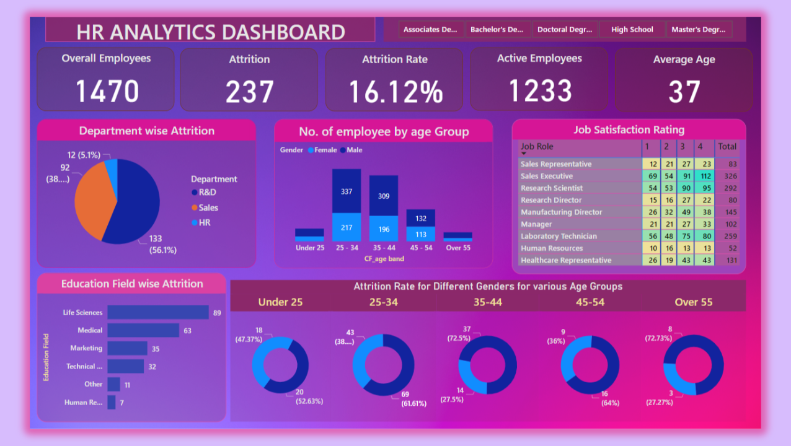

📊 HR-Analytics Dashboard Using Power BI

This project analyzes an HR dataset to uncover employee attrition trends and key workforce insights using Power BI. It provides an interactive dashboard with visuals that help understand employee turnover, satisfaction, department performance, and other HR metrics.

🛠 Tools Used

Power BI Desktop – Dashboard creation and visualizations

Excel / Power Query – Data transformation and cleaning

CSV Dataset – HR employee data

GitHub – Project repository and documentation

📌 Key Features

Attrition analysis (Yes/No)

Department-wise employee distribution

Salary and performance insights

Job satisfaction and role analysis

Interactive filters for dynamic exploration

📈 Dashboard Overview

📂 Repository Structure
HR-Analytics-Dashboard/
│
├── HR_Data.csv
├── HR_Analytics_Dashboard.pbix
├── Images/
│   └── dashboard_preview.png
└── README.md

🚀 How to Use

Download the Power BI (.pbix) file.

Open it in Power BI Desktop.

Use the slicers and filters to interact with the HR data.

Explore insights dynamically.

💡 Insights (Example)

The highest attrition is observed in certain departments.

Employee satisfaction and salary levels influence attrition.

Tenure and performance rating show interesting trends against attrition.

(Replace with your actual insights after making the dashboard your own.)

📌 Skills Demonstrated

✔ Data cleaning and preprocessing
✔ Dashboard design with Power BI
✔ Interactive visualization
✔ Analytical reasoning and insight generation# HR-Analytics